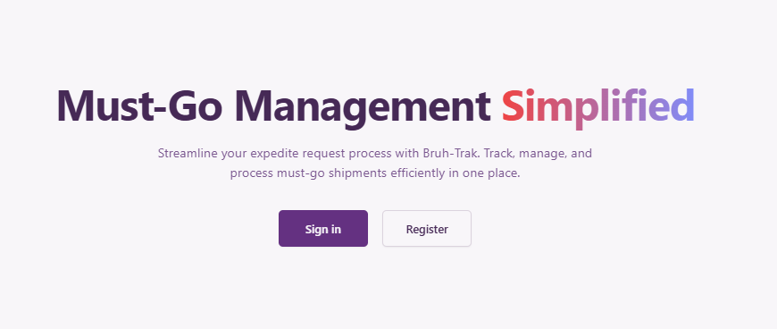
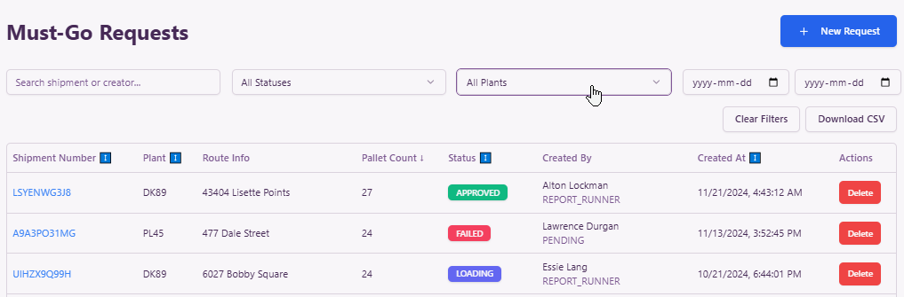
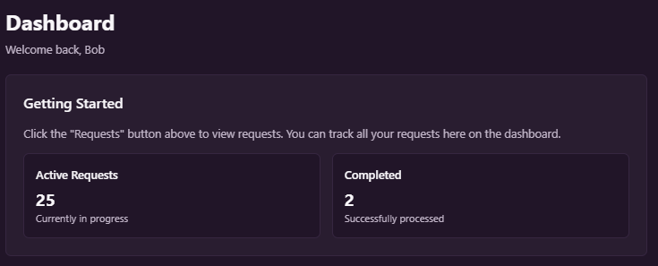

# Expi-Trak: Expedite Material Request Tracker

A web application for tracking and managing "must-go" and expedite material requests, facilitating communication between customer service and warehouse teams.



## Features

### Core Functionality

- **Real-time Tracking**: Monitor expedite requests in real-time with instant status updates
- **Analytics Dashboard**: Comprehensive analytics to track performance and identify trends
- **Team Collaboration**: Seamless communication between customer service and warehouse teams
- **Efficient Processing**: Streamlined workflow for faster must-go shipment processing

### Key Features

- Role-based access control (Admin, Customer Service, Warehouse)
- Comprehensive request tracking with status updates
- Part information management
- Email notifications for important events
- Multi-site support with site-specific settings
- Responsive design for all devices
- Dark/Light theme support

### User Interface


_Request management interface for easy tracking and updates_


_Comprehensive dashboard for performance monitoring_

## User Roles

### Customer Service Team

- Submit and track expedite requests with ease
- Get real-time updates on shipment status
- Maintain clear communication with warehouse team
- Access comprehensive request history

### Warehouse Staff

- Access clear queue of prioritized requests
- Mark items as processed in real-time
- Maintain efficient workflow
- Stay organized with intuitive interface

### Administrators

- Manage user access and permissions
- Monitor system performance
- Generate reports and analytics
- Configure system settings

## Tech Stack

- **Frontend:** Next.js 14 with TypeScript
- **Styling:** Tailwind CSS with ShadCN UI components
- **Backend:** Next.js API Routes
- **Database:** PostgreSQL with Prisma ORM
- **Authentication:** NextAuth.js with JWT and secure password handling
- **Email Service:** Resend API for transactional emails
- **Hosting:** Vercel (Frontend) + Neon.tech (PostgreSQL)

## Getting Started

### Prerequisites

- Node.js 18+
- npm or yarn
- PostgreSQL database (local or Neon.tech)

### Installation

1. Clone the repository:

```bash
git clone https://github.com/ashlessscythe/expi-trako.git
cd expi-trako
```

2. Install dependencies:

```bash
npm install
```

3. Set up environment variables:

```bash
cp .env.example .env
```

Edit `.env` with your database credentials and other configuration:

- `DATABASE_URL`: Your PostgreSQL connection string
- `RESEND_API_KEY`: API key for Resend email service
- `EMAIL_FROM_DOMAIN`: Domain for sending emails
- `NEXTAUTH_SECRET`: Secret for NextAuth.js
- `NEXTAUTH_URL`: URL for NextAuth.js (e.g., http://localhost:3000)
- `NEXT_PUBLIC_APP_NAME`: Application name displayed in UI

4. Initialize the database:

```bash
npx prisma generate
npx prisma db push
```

5. Start the development server:

```bash
npm run dev
```

Visit `http://localhost:3000` to see the application.

## Project Structure

```
expi-trako/
├── src/
│   ├── app/          # Next.js 14 app directory
│   │   ├── api/      # API routes for backend functionality
│   │   ├── (auth)/   # Authentication-related pages
│   │   ├── admin/    # Admin dashboard and management
│   ├── components/   # Reusable UI components
│   │   ├── admin/    # Admin-specific components
│   │   ├── requests/ # Request management components
│   │   ├── ui/       # Shared UI components
│   ├── lib/          # Utility functions and configurations
│   │   ├── types/    # TypeScript type definitions
│   │   ├── utils/    # Helper utilities
├── prisma/
│   └── schema.prisma # Database schema
├── public/           # Static assets
│   ├── templates/    # CSV templates for bulk uploads
│   ├── videos/       # Tutorial and demo videos
└── docs/            # Project documentation
```

## Email Functionality

Expi-Trak includes a comprehensive email notification system powered by the Resend API:

- **Transactional Emails**: Automated emails for important events

  - New user registration notifications
  - Password reset requests
  - Request status updates
  - Request completion notifications

- **Notification Lists**: Configure plant-specific email distribution lists

  - Customizable per site and plant
  - Different notification levels for various stakeholders
  - Enable/disable email notifications per list

- **Email Templates**: Customizable email templates for different notification types
  - Request created notifications
  - Request completed notifications
  - User account notifications
  - Password reset emails

## Available Scripts

- `npm run dev` - Start development server
- `npm run build` - Build for production
- `npm start` - Start production server
- `npm run lint` - Run ESLint
- `npm run prisma:studio` - Open Prisma Studio

## Contributing

1. Fork the repository
2. Create your feature branch (`git checkout -b feature/AmazingFeature`)
3. Commit your changes (`git commit -m 'Add some AmazingFeature'`)
4. Push to the branch (`git push origin feature/AmazingFeature`)
5. Open a Pull Request

## License

This project is licensed under the MIT License - see the [LICENSE](LICENSE) file for details.
