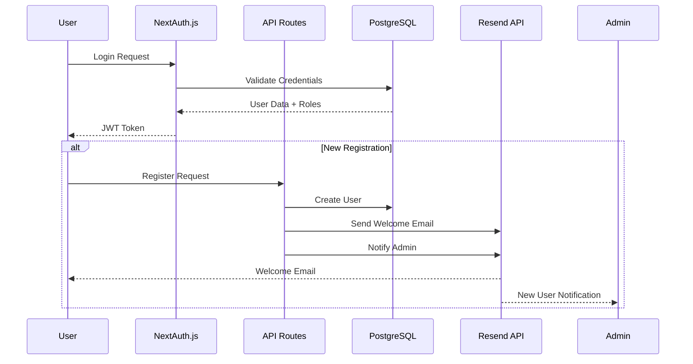

# Authentication Flow Diagram

This diagram shows the authentication process in Expi-Trak, including login and registration flows.

## Process Description

### Login Flow
1. User submits login credentials
2. NextAuth.js validates credentials against database
3. Database returns user data and roles
4. JWT token issued to user

### Registration Flow
1. User submits registration request
2. API creates new user in database
3. Welcome email sent to user
4. Admin notification sent for new registration
5. User awaits admin approval 