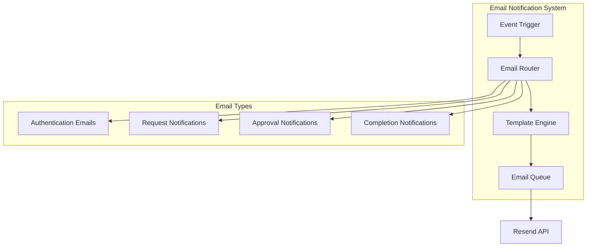

# Email Notification System Diagram

This diagram shows the email notification architecture and workflow in Expi-Trak.

## System Components

### Core Components
- **Event Trigger**: System events that initiate email notifications
- **Email Router**: Routes notifications to appropriate templates
- **Template Engine**: Generates email content from templates
- **Email Queue**: Manages email sending with rate limiting

### Email Categories
1. **Authentication Emails**
   - Welcome emails
   - Password reset
   - Account verification

2. **Request Notifications**
   - New request creation
   - Request updates
   - Status changes

3. **Approval Notifications**
   - Approval requests
   - Approval confirmations
   - Rejection notices

4. **Completion Notifications**
   - Request completion
   - Processing confirmations
   - Final status updates 