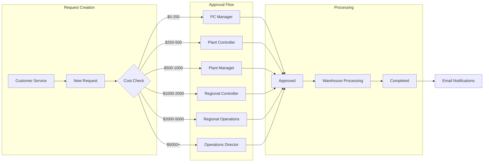

# Request Processing Flow Diagram

This diagram illustrates the complete lifecycle of an expedite material request in the system.

## Process Description

### Request Creation
- Customer Service team initiates new expedite requests
- System automatically determines approval route based on cost

### Approval Levels
1. **PC Manager**: $0-250
2. **Plant Controller**: $250-500
3. **Plant Manager**: $500-1,000
4. **Regional Controller**: $1,000-2,000
5. **Regional Operations**: $2,000-5,000
6. **Operations Director**: $5,000+

### Processing Steps
1. Request approved by appropriate authority
2. Warehouse team processes approved request
3. Request marked as complete
4. Automatic notifications sent to stakeholders 