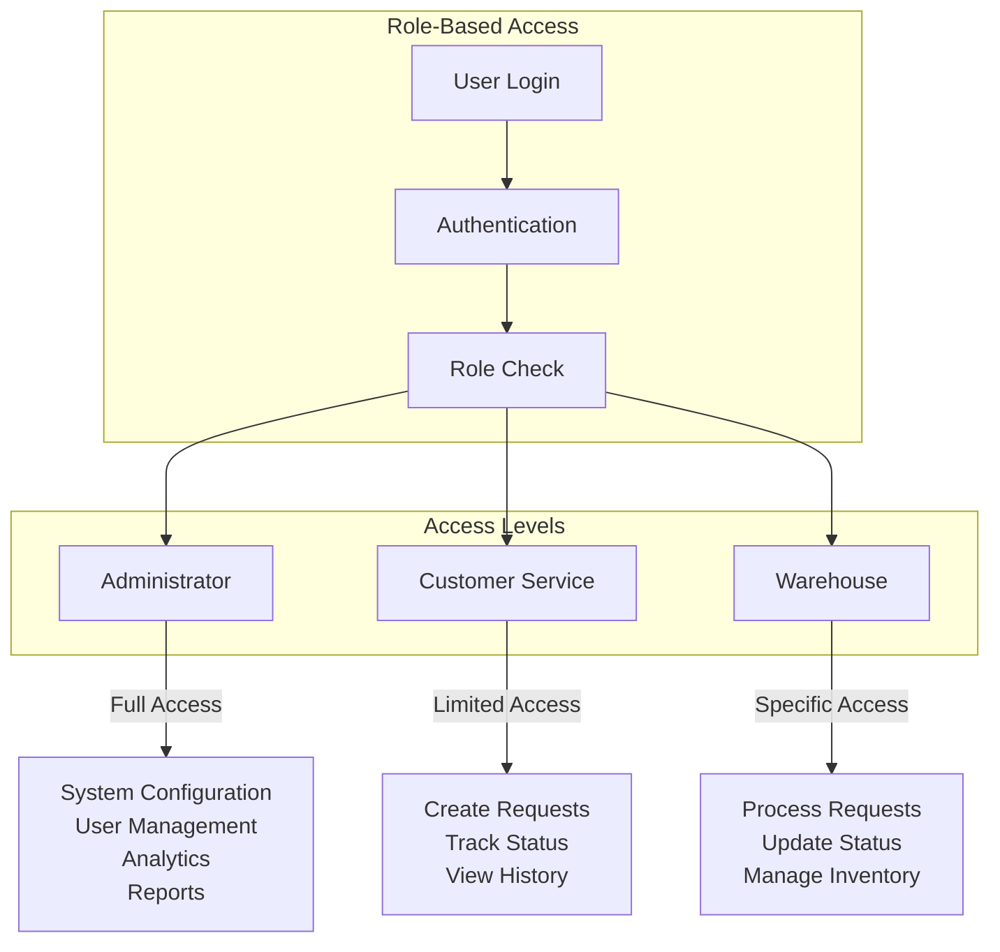

# Role-Based Access Control Diagram

This diagram illustrates the role-based access control (RBAC) system in Expi-Trak.

## Role Descriptions

### Administrator
- Full system configuration access
- User management and role assignment
- Analytics and reporting capabilities
- System-wide settings management

### Customer Service
- Create and submit expedite requests
- Track request status
- View request history
- Basic reporting access

### Warehouse Staff
- Process approved requests
- Update request status
- Manage inventory
- View assigned tasks

## Access Control Implementation
- JWT-based authentication
- Role-based middleware checks
- Granular permission system
- Secure API endpoints 