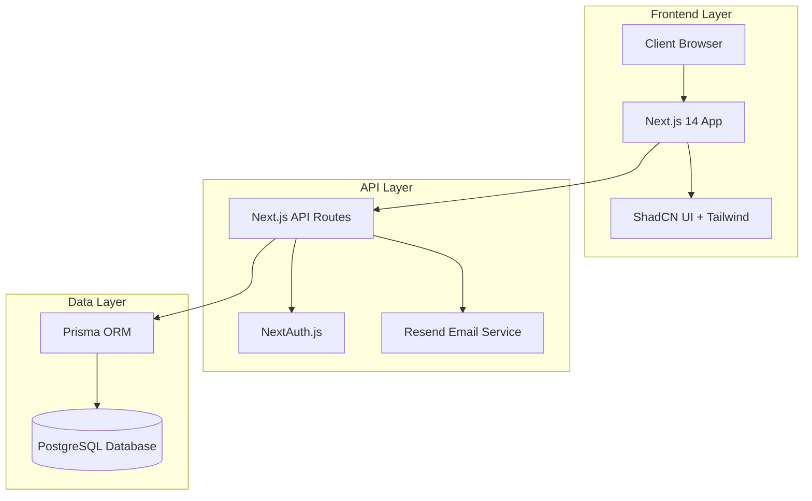

# System Architecture Diagram

This diagram illustrates the three-tier architecture of the Expi-Trak system, showing how different components interact with each other.

## Component Description

### Frontend Layer
- **Client Browser**: End-user access point
- **Next.js 14 App**: Main application framework
- **ShadCN UI + Tailwind**: UI component library and styling

### API Layer
- **Next.js API Routes**: Backend API endpoints
- **NextAuth.js**: Authentication service
- **Resend Email Service**: Email notification system

### Data Layer
- **Prisma ORM**: Database object-relational mapping
- **PostgreSQL Database**: Primary data storage 